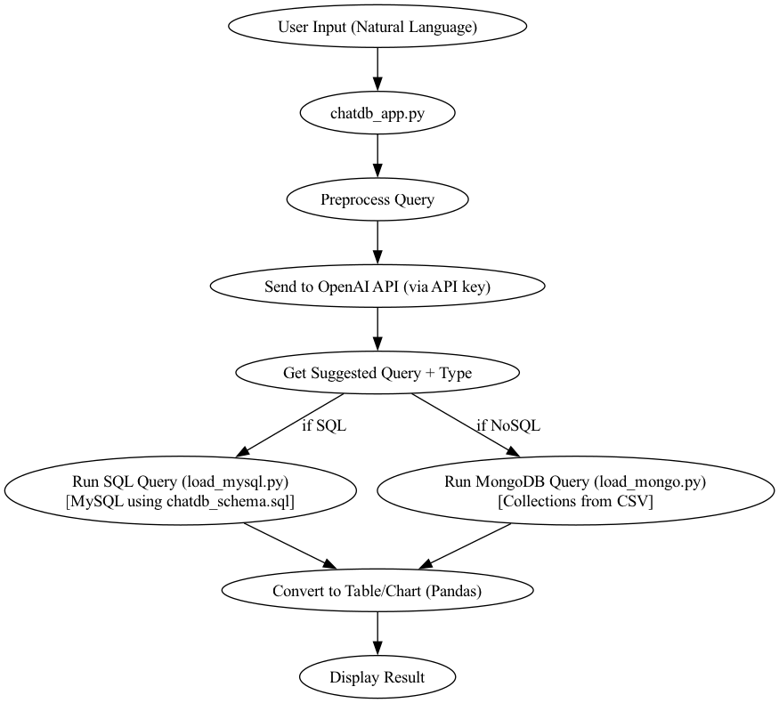

# ChatDB: Natural Language Interface for SQL and NoSQL Databases

> An LLM-powered system that translates natural language into executable MySQL and MongoDB queries.

ChatDB allows users to interact with both relational and NoSQL databases using plain English.
The system interprets user input, determines the appropriate backend, generates executable queries using an LLM, and returns results in a readable format.

---

## Motivation

Traditional database systems require knowledge of query languages and schema structure.

This project explores a more accessible workflow:

> Can users query and modify databases using natural language instead of writing SQL or MongoDB queries manually?

---

## System Architecture



The system processes natural language input, generates a structured query using an LLM, and routes execution to either MySQL or MongoDB depending on the query intent.

---

## System Overview

Core functionality includes:

- Natural language → **SQL query generation (MySQL)**
- Natural language → **MongoDB query generation (PyMongo)**
- Automatic backend routing (SQL vs NoSQL)
- Schema-aware prompting for both databases
- Support for read and write operations
- Secure MongoDB query execution using `ast.literal_eval()` (no `eval`)

---

## Databases

### MySQL (Relational)

Stores structured data including:

* cities and population data
* household types
* living wages
* poverty thresholds and distributions

Schema defined in: `chatdb_schema.sql`

---

### MongoDB (NoSQL)

Stores semi-structured wage-by-education data in three collections:

* `wages_overall`
* `wages_gender`
* `wages_race`

Data is loaded and transformed from CSV into multiple collections for flexible querying.

---

## Project Workflow

1. Define relational schema (`chatdb_schema.sql`)
2. Load structured data into MySQL (`load_mysql.py`)
3. Load and transform data into MongoDB (`load_mongo.py`)
4. Accept natural language input
5. Generate query using LLM
6. Route to appropriate database (SQL or MongoDB)
7. Execute query and display results

---

## Example Queries

### MySQL

* “What is the living wage for one adult with one kid in Los Angeles?”
* “Show tables”
* “Update the population of Los Angeles to 4000000”

### MongoDB

* “Show the average bachelor degree wage in 2021”
* “Compare men vs women high school wage in 2020”
* “Update the 2022 black_women_advanced_degree wage to 40.0”

---

## Repository Structure

```text
chatdb-natural-language-database/
│
├── chatdb_app.py
├── chatdb_schema.sql
├── load_mysql.py
├── load_mongo.py
│
├── data/
│   ├── livingwage.csv
│   ├── poverty_level_wages.csv
│   └── wages_by_education.csv
│
├── reports/
│   └── final_report.pdf
│
├── assets/
│   └── chatdb_flow_diagram.png
│
├── README.md
└── requirements.txt
```

---

## How to Run

1. Clone the repository:

```bash
git clone <repo_url>
cd chatdb-natural-language-database
```

2. Create and activate a virtual environment:

```bash
python3 -m venv .venv
source .venv/bin/activate
```

3. Install dependencies:

```bash
pip install -r requirements.txt
```

4. Set up environment variables in a `.env` file:

```env
OPENAI_API_KEY=your_key_here

MYSQL_HOST=localhost
MYSQL_USER=root
MYSQL_PASSWORD=your_password
MYSQL_DB=chatdb_relational

MONGO_URI=mongodb://localhost:27017/
MONGO_DB_NAME=chatdb_nosql
```

5. Initialize MySQL schema:

```bash
mysql -u root -p < chatdb_schema.sql
```

6. Load data into databases:

```bash
python load_mysql.py
python load_mongo.py
```

7. Run the application:

```bash
python chatdb_app.py
```

---

## My Contributions

* Implemented the MongoDB backend and data pipeline
* Designed NoSQL schema for wage-by-education data
* Structured data into `wages_overall`, `wages_gender`, and `wages_race` collections
* Integrated MongoDB query execution into the unified system
* Collaborated on combining SQL and NoSQL workflows into a single natural language interface

---

## 📄 Report

Full report:
👉 [Final Report](reports/final_report.pdf)

---

## Notes

* Requires local MySQL and MongoDB instances
* Uses schema-aware prompting for query generation
* `.env` is required for credentials and should not be committed

---

## Tech Stack

* Python
* OpenAI API
* MySQL
* MongoDB
* PyMySQL
* PyMongo
* pandas
* python-dotenv
* tabulate

---
